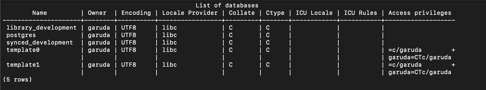
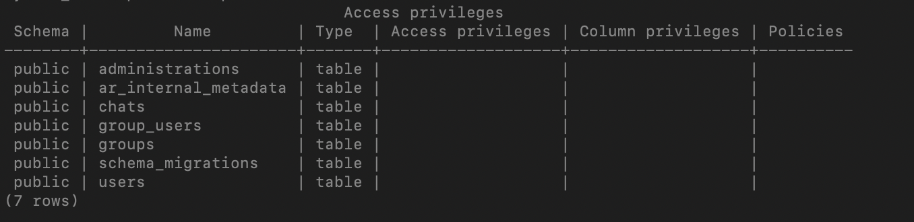

In here we learn about how to crete new user in postgres and assign them.
First you need to go into your terminal and connect to postgress shell.
```bash
psql -u postgres
# if you are using mac and installed using brew then use below command
psql postgres
```
If you want to connect to postgress shell with specific table name, then
```bash
psql -u YOUR_TABLE_NAME
# if you are using mac and installed using brew then use below command
psql YOUR_TABLE_NAME
```

Once you have done that you will be in the shell.
Here if you want to see the users and their roles then you can type
```bash
\du # which means like database users
```
This will show you somethings like below image.  


What if you want to see list of databases. Then you can type
```bash
\l # which means like list of databases
```

This will show you something like below image.  



Now let's look into how to create user and his roles.  
Creating a user is pretty simple.
```bash
CREATE ROLE user_name with LOGIN PASSWORD 'some_password';
```
This will create a user with default roles(By default it should not have any roles).
For example let's create a user named 'test_user'. Now when I print the users list, you can see something like below image.


As you can see in attributes it's empty. Means you don't have any roles added to the user.

That means he don't have access to anything.
How do we know that? Just by trying to login into shell with that user and do some querry. Let's see

```bash
psql -d some_database -U test_user
```
Here I'm trying to connect to particular database as user name "test_user".

Once I'm inside the shell let's try fetching the some data from database.

```bash
some_database=> select * from users
```
The above querry will throw me an error saying `ERROR:  permission denied for table users`.

Now, how can we give access to only a particular database?  
We can run the below command to give the access to particular database.

```bash
some_database=> GRANT CONNECT ON DATABASE some_database TO test_user
```

NOTE: Make sure you are not trying this in shell as the same user you want to give access to. Try with another user who has access to provide access to the database.

Now "test_user" can able to connect to "some_database". But remember this he can able to only connect to it but he don't have access to any schemas or tables.

You can check privilages of all tables in the database
```bash
\dp # dp here means database privilages
```

This will show somethings like this.


If test_user has access to the tables you can find all them in access privilages column.

So how can I access to all those schemas and tables?

First get access to schema. To give access to schema you need to do
```bash
some_database=> GRANT USAGE ON SCHEMA public TO test_user;
```

Now you have access to schema get the access to table.

For now let's give access to just fetch the data from table.
```bash
some_database=> GRANT SELECT ON ALL TABLES IN SCHEMA public TO test_user;
```

Volla!! Now you can access any table inside "public" schema to fetch the data. Cool right. 
Wait a minute. But What about adding, updating, deleting, creating new tables....?  
Well you guessed it right, you don't have access to them. 

You can give specific access to specific tables too. For example you need to have access to only a table named "some_table". Then you can do like this
```bash
some_database=> GRANT INSERT, UPDATE, DELETE ON TABLE table_name TO test_user;
```

// TODO: This file is still in progress