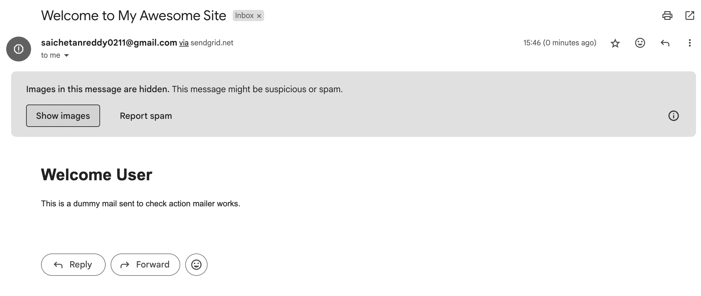

# ActionMailer for emails

ActionMailer is part of rails that is used to send emails from your application. It is a very simple yet powerful.

NOTE: Add Sidekiq to your application to send emails in background. [Check out Sidekiq](./sidekiq.md)

We need to configure the smtp in cofig file for all environments. And here I'm using Sendgrid as my mailing service.

So in my `config/environments/development.rb` file add the following code
```ruby
config.action_mailer.delivery_method = :smtp

  config.action_mailer.smtp_settings = {
    address:              'smtp.sendgrid.net',
    port:                 587,
    domain:               'example.com',
    user_name:            'apikey', # This is the string "apikey", not your SendGrid username
    password:             Rails.application.credentials.sendgrid[:api_key], # Your SendGrid API key
    authentication:       'plain',
    enable_starttls_auto: true
  }

  config.action_mailer.perform_deliveries = true
  config.action_mailer.raise_delivery_errors = true

  config.action_mailer.default_url_options = { host: 'localhost', port: 3000 }
```

Nowe you need to create a mailer using generator.
```bash
rails generate mailer UserMailer
```

Generator then creates new files 

`app/mailers/user_mailer.rb` It works more like a controller
`app/views/user_mailer` In this folder we can create email views for user mails
(Below two files are used for testing)
`test/mailers/user_mailer_test.rb`
`test/mailers/previews/user_mailer_preview.rb`

So each mail will be a method and you need to be creating the files for those methods in respected folder. For example let's create a dummy mail in user_mailer.

```ruby
# app/mailers/user_mailer.rb
class UserMailer < ApplicationMailer
  default from: 'no-reply@yourdomain.com'
  def dummy_email(user_email)
  mail(to: user_email,subject: 'Welcome to My Awesome Site')
  end
end
```

Create `dummy_email.html.erb` inside `app/views/user_mailer` folder.
```html
<!DOCTYPE html>
<html>
  <body>
    <h1>Welcome User</h1>
    <p>This is a dummy mail sent to check action mailer works.</p>
  </body>
</html>
```

Next part is to send email. To send email, inside the controller you need to call the mailer.

```ruby
UserMailer.dummy_email("saichetanreddy0211@gmail.com").deliver_now
```

This will send the email immediatly.


deliver_now is a synchronous method of sending the email.  
To send it asynchronously we can use deliver_later method. We can even set time to send email using deliver_later method.

```ruby
UserMailer.dummy_email("saichetanreddy0211@gmail.com").deliver_now # sends the email immediatly and uses synchronus so code will wait until the email is sent.
UserMailer.dummy_email("saichetanreddy0211@gmail.com").deliver_later # sends email asynchronously, it will be queued.
UserMailer.dummy_email("saichetanreddy0211@gmail.com").deliver_later(queue: 'mailers') # sends email asynchronously and it will be queued to particular queue called 'mailers'.
UserMailer.dummy_email("saichetanreddy0211@gmail.com").deliver_later(wait: 5.minutes) # sends the email after 5 minutes.
```

### Send attachments via email.

You can attach files are images to your email. In your mailer you need to add attachement.
```ruby
# app/mailers/user_mailer.rb
def dummy_email(user_email)
    attachments['test_file.pdf'] = File.read(Rails.root.join('app', 'assets', 'pdfs', 'test_file.pdf'))
    
    mail(to: user_email,subject: 'Testing the Active Mailer')
  end
```

Now you can see the attached PDFs in your email.

### Send inline images

YOu can even send in-line images in your email. In the same way we need to add the image attachment.

```ruby
# app/mailers/user_mailer.rb
def dummy_email(user_email)
    attachments.inline['test_image.png'] = File.read(Rails.root.join('app/assets/images/test_image.png'))
    
    mail(to: user_email,subject: 'Testing the Active Mailer')
  end
```

Now in your view file for email you need to add the image attachment.

```html
<!DOCTYPE html>
<html>
  <body>
    <h1>Welcome User</h1>
    <p>This is a dummy mail sent to check action mailer works.</p>
    <%= image_tag attachments['test_image.png'].url, alt: 'Company Logo' %>
  </body>
</html>
```

That's it. Now you can see the image attachment in your image.