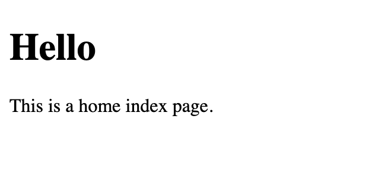
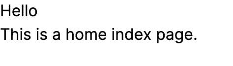

# Add Tailwind to the project

In here we will learn how to configure tailwind to the project. It's pritty simple one. Start with adding tailwind in Gemfile.

```ruby
gem "tailwindcss-rails", "~> 2.6"
```

Now you need to create a file named `application.tailwind.css` in `app/assets/stylesheets` and add the following lines.
```css
@tailwind base;
@tailwind components;
@tailwind utilities;
```

Then go into `app/assets/config/manifest.js` and add the following lines

```javascript
//= link_tree ../builds
```

Then you need to create `tailwind.config.js` in `config` folder. Then add the following lines

```javascript
const defaultTheme = require('tailwindcss/defaultTheme')
module.exports = {
  content: [
    './public/*.html',
    './app/helpers/**/*.rb',
    './app/javascript/**/*.js',
    './app/views/**/*.{erb,haml,html,slim}'
  ],
  theme: {
    extend: {
      fontFamily: {
        sans: ['Inter var', ...defaultTheme.fontFamily.sans],
      },
    },
  },
  plugins: [
    require('@tailwindcss/forms'),
    require('@tailwindcss/typography'),
    require('@tailwindcss/container-queries'),
  ]
}
```

Then add the below line inside 'head' in `app/views/layouts/application.html.erb`

```html
<%= stylesheet_link_tag "tailwind", "inter-font", "data-turbo-track": "reload" %>
```

Now we have the following code in my home page
```html
<h1>Hello</h1>
<p>This is a home index page.</p>
```

This is how web page looks: 

Before tailwind CSS


After tailwind CSS


NOTE: By default tailwind dosen't know the difference between h1 tag and p tag. So everthing it shows as p tag like. We need to set those default tag values.

To have custom values like having custom size for specific tags or having custom colors you need to add those in `tailwind.config.js`.

```javascript
//..
  extend: {
      fontFamily: {
        sans: ['Inter var', ...defaultTheme.fontFamily.sans],
      },
      // Custom zindex values
      zIndex: {
        '-1': '-1',
        '-2': '-2',
      },
      // Custom heights
      height: {
        '80vh': '80vh',
        '100vh': '100vh',
        'fullscreen':'calc(100vh - 4rem)'
      },
      // Custom width
      width: {
        '100vh': '100vh' 
      },
      // Custom tag size
      fontSize: {
        h1: '2em',
      },
      // Custom colors
      colors: {
        'primary-color': {
          'default': '#ff5758', // This is a primary color
          50: '#ffe5e5',
          100: '#ffcccc',
          200: '#ff999a',
          300: '#ff6667',
          400: '#ff3334',
          500: '#ff0001',
          600: '#e60000',
          700: '#cc0000',
          800: '#b30000',
          900: '#990000',
        }
      }
    },
//..
```