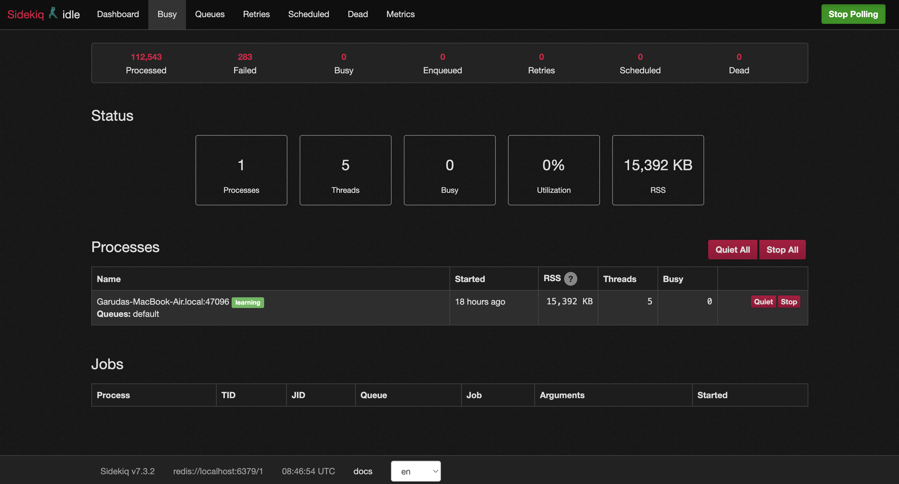

# Working with Sidekiq Gem

Sidekiq is a gem that is used for processing background jobs and manage them in rails. It helps rails in doing asynchronous tasks for smoooth and better performance. Sidekiq uses multithreading to handle many jobs at the same time.

Before using Sidekiq you will be needing **Redis** in your application.  
(Checkout [Redis](./redis.md) for more information and setup procedure.)

Once Redis setup is done we need to add sidekiq to the gemfile.
```ruby
gem 'sidekiq'
```

`bundle install` to add all th dependencies of sidekiq. After that we need to add the `config/initializers/sidekiq.rb` file and copy the following code.
```ruby
Sidekiq.configure_server do |config|
  config.redis = { url: ENV.fetch('REDIS_URL') { 'redis://localhost:6379/1' } }
end

Sidekiq.configure_client do |config|
  config.redis = { url: ENV.fetch('REDIS_URL') { 'redis://localhost:6379/1' } }
end
```

After that you need to set queue adaptor to use sidekiq.

`config/application.rb`
```ruby
config.active_job.queue_adapter = :sidekiq
```

That's it. Sidekiq is ready to use. You can check it with ActionMailer by sending a mail to send later after sometime.

You can actually check the sidekiq dashboard using default dashboard for it. To access it we need to add the routes in `routes.rb` file.

```ruby
mount Sidekiq::Web => '/sidekiq'
```

After mounting the routes you can run the application and go into `/sidekiq` rotue to access the dashboard.

dashboard should look something like below:
